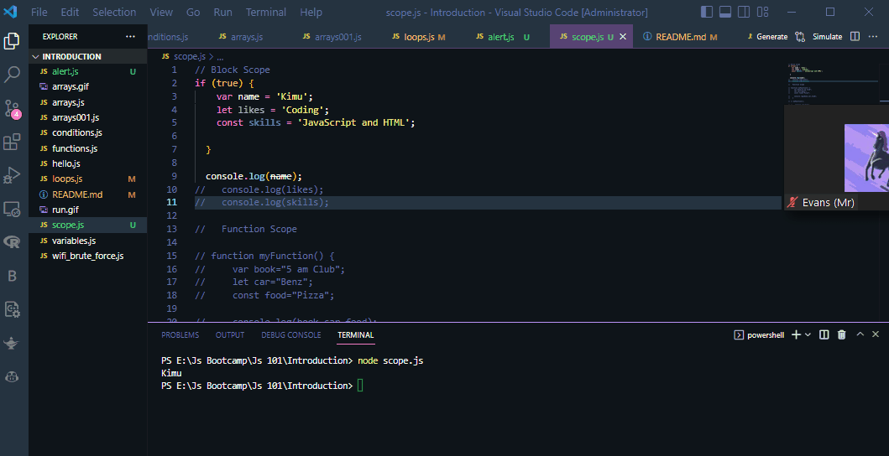

# Arrays


# Scope


## Javascript has three scope types:
-Block scope
-Function scope
-Global scope

## Block scope
-Block scope is the area within if, switch conditions or for and while loops. Generally speaking, whenever you see {curly brackets}, it is a block. In ES6, const and let keywords allow developers to declare variables in the block scope, which means those variables exist only within the corresponding block.
```javascript
if (true) {
  // this 'if' conditional block doesn't create a scope
  var name = 'Kimu';  // name is in the global scope because of the 'var' keyword
  let likes = 'Coding';  // likes is in the block scope because of the 'let' keyword
  const skills = 'JavaScript and HTML';  // skills is in the block scope because of the 'const' keyword

}
console.log(name); // prints 'Kimu'
console.log(likes); // Uncaught ReferenceError: likes is not defined
console.log(skills); // Uncaught ReferenceError: skills is not defined
```

## Function scope
-Function scope means that variables are accessible within the function they are defined in, or if not defined in a function, within the global scope.
```javascript
function myFunction() {
  // carName can be used only within this function
  var carName = 'Volvo';
}

// carName is not defined outside the function
console.log(carName); // Uncaught ReferenceError: carName is not defined
```

## Global scope
-Variables declared outside of blocks or functions can be accessed from anywhere in the code. Each variable declared globally becomes a property of the global window object.
```javascript
var carName = 'Volvo';

// code here can use carName

function myFunction() {
  // code here can also use carName
}
```

## Hoisting- English definition("raise (something) by means of ropes and pulleys.")
-Hoisting is a JavaScript mechanism where variables and function declarations are moved to the top of their scope before code execution. Naturally, this means that no matter where functions and variables are declared, they are moved to the top of their scope regardless of whether their scope is global or local.
```javascript
console.log(num); // Returns undefined, as only declaration was hoisted, no initialization has happened at this stage
var num; // Declaration
num = 6; // Initialization
console.log(num); // Returns 6
```
